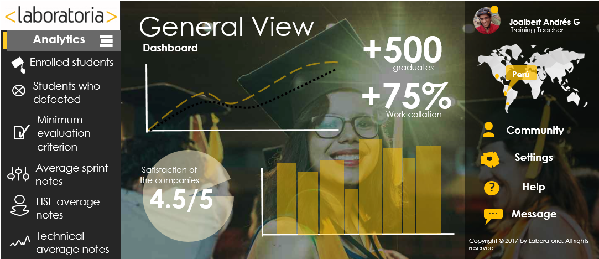
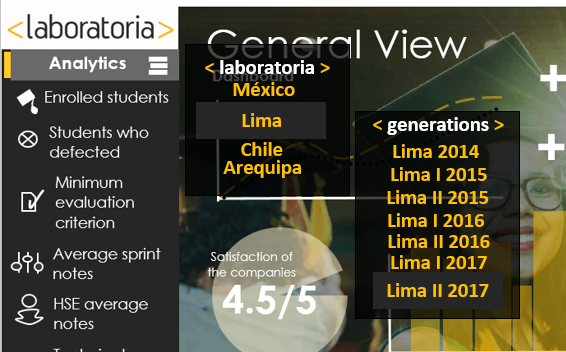
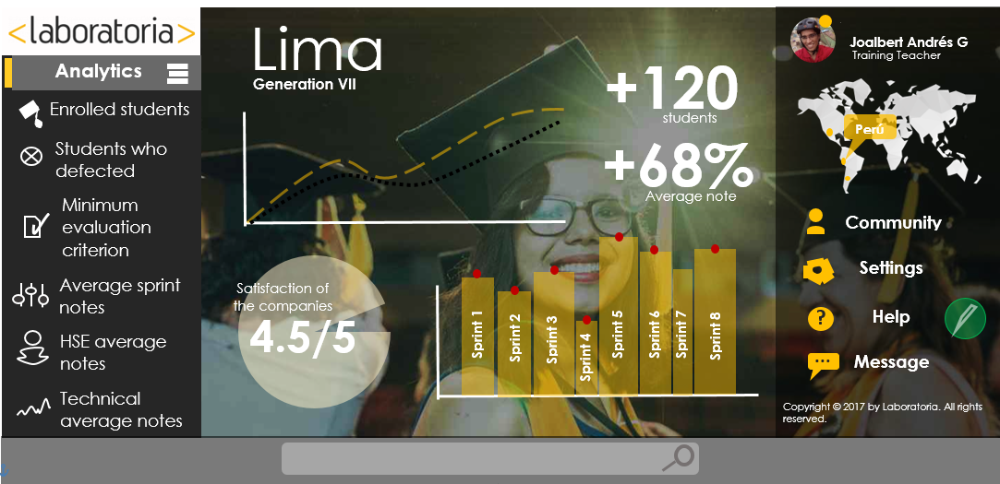
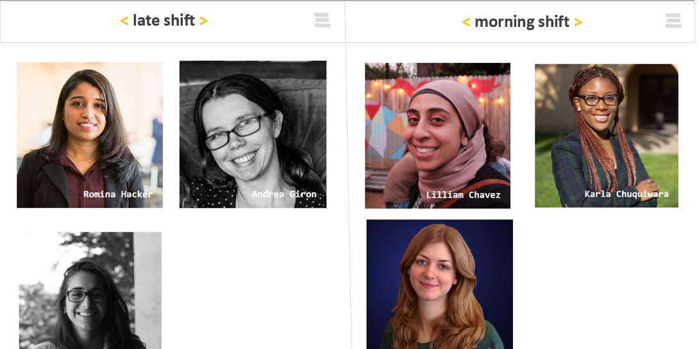
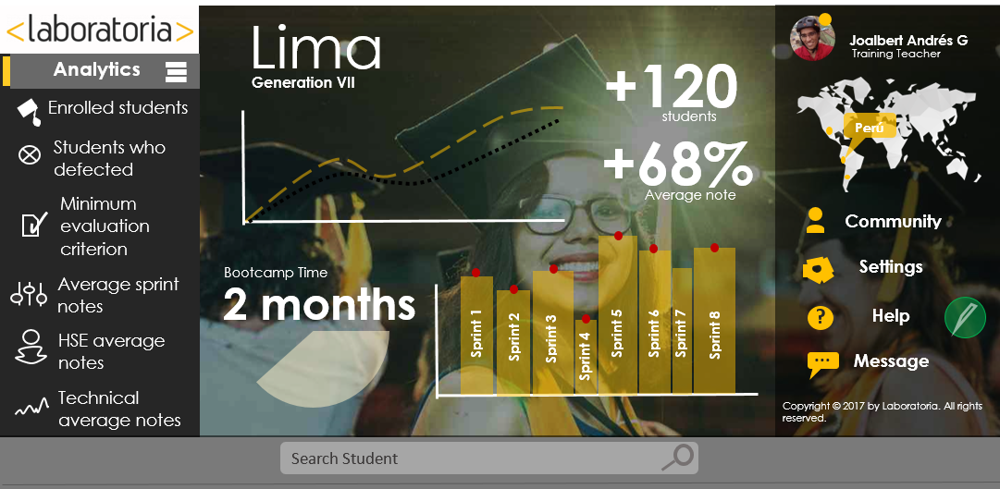
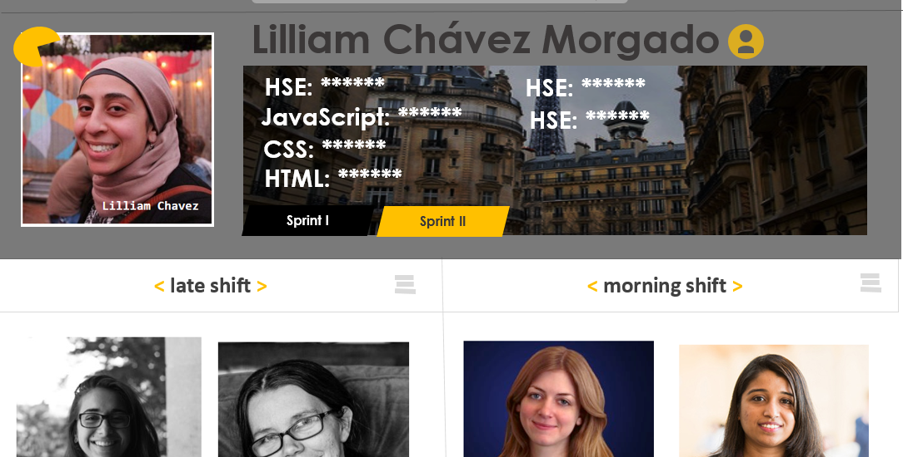

#  Reto tres: Dashboard Laboratoria
El dashboard es una herramienta utilizada por profesores, training managers, directores y gerentes de Laboratoria para ver rápidamente qué está pasando en el salón de clases de Laboratoria. En el dashboard, los usuarios mencionados pueden ver rápidamente estadísticas y datos en tiempo real como:

*  **de alumnas inscritas**
*  **de alumnas que desertaron**
*  **y % de alumnas que pasan el criterio mínimo de evaluación**
*  **Promedio de notas por sprint**
*  **Promedio de notas HSE**
*  **Promedio de notas técnicas**

>Además, dado que Laboratoria tiene muchas generaciones, regularmente 2 generaciones por año (estas generaciones empezaron en el 2014), y que opera en 4 sedes (Arequipa, Ciudad de México, Lima y Santiago de Chile), es posible que los usuarios quieran ver datos de sedes / generaciones anteriores para poder hacer comparaciones.

---------------------------------------------------------------------------------------------------------------------------------

## Vista general
En la vista general podemos ver:
* Una **barra de mebu** que nos aparecera en cuanto entremos a la seccion Analytics de la cuenta de Laboratoria, esta contiene la opcion de visulaizar datos estadisticos de las estudiantes como: 
- Numero de estudiantes.
- Estudiantes retiradas.
- Alumnas que pasan el promedio minimo.
- Notas promedio del sprint.
- Notas promedio del nivel tecnico.
>Cada una de las **opciones** anteriores visualizan datos generales o globales.
* Al centro de la pantalla podemos ver el espacio donde se podran ver los datos, tablas, etc.
* Al lado derecho se ubica el menu del user o **utilidades**

## Opciones de visualizacion de resultados: Segun sede y segun generacion
* En la siguiente imagen podemos ver que analytics te permite acceder a un pequeño menu donde puede elegir la sede de Laboratoria y la promocion de la que queremos ver datos estadisticos y organizacionales.

## Vista Local(Lima)
* Al entrar a la opcion **Lima II 2017** a parte de poder ver las estadisticas y el progreso del bootcamp, se nos desplagara una seccion inferior en la que podremos ver a las coders clasificadas por su horario de estudio ordenadas desde "la mas buscada" a "la menos buscada".
* Para mayor comodidad tambien se ha colocado un buscador justo antes de la seccion de las coders, aqui se podran buscar los perfiles de los estudiantes, los sprints por nombres, etc.
* El usuario ademas contara con un boton fijado color verde que servira para si desea editar la informacion(siempre y cuando tenga permiso de hacerlo).

## Perfil de las alumnas 
* Una vez que una alumna es seleccionada nos aparecera su informacion justo bajo el buscador, ademas se podra acceder a datos mas a fondo, como evaluaciones psicologicas, etc haciendo un click en el icono del user.

